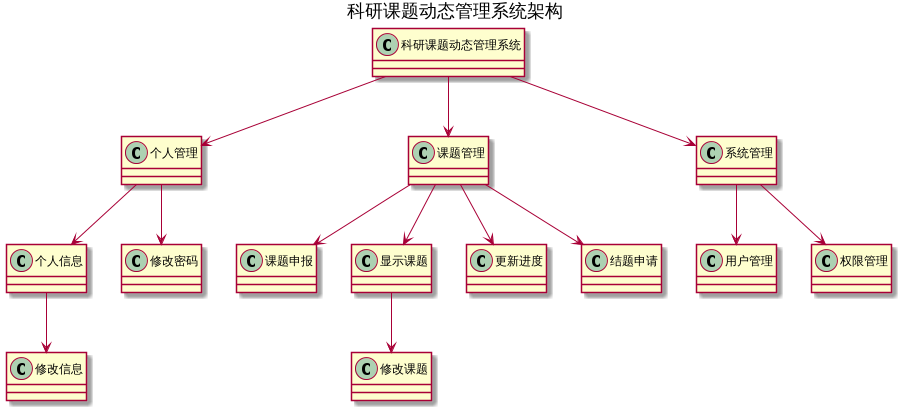

# 架构 #

# 开发 #

## 数据库 ##

### 账户 ###

管理员账户

* 用户： root
* 密码： a

普通账户

* 用户： yangjiang
* 密码： 123

### 连接 ###

|   项   |      值       |
| :----: | :-----------: |
|   IP   | 192.168.1.161 |
|  端口  |     3307      |
| 数据库 |   research    |
| 用户名 |   yangjiang   |
|  密码  |      123      |

* [字段](research.sql '字段')
